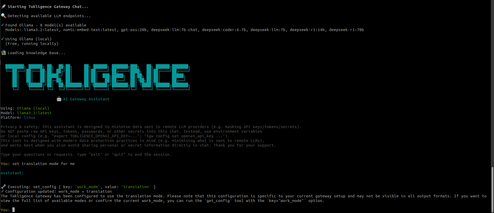

# @tokligence/gateway

[](https://www.npmjs.com/package/@tokligence/gateway)
[](https://opensource.org/licenses/Apache-2.0)
[](https://github.com/tokligence/tokligence-gateway-npm/actions/workflows/sync-release.yml)

**NPM installation for [Tokligence Gateway](https://github.com/tokligence/tokligence-gateway)** - The first open-source AI gateway with two-way token trading.

> **TL;DR**: Tokligence Gateway is a high-performance LLM gateway that protects your AI agents from data leaks, enables elastic token capacity through marketplace trading, and provides unified multi-provider access. The trusted infrastructure layer for the AI-native enterprise.

## 🌐 Vision

**Three pillars for the AI-native era:**

### 🛡️ The Trusted Partner for Coding Agents

Your AI agents handle sensitive code, secrets, and business data. Tokligence protects them:

- **PII Prompt Firewall** - Real-time detection and redaction of sensitive data across 100+ languages
- **API Key Protection** - Detects 30+ provider keys (OpenAI, AWS, GitHub, Stripe, etc.) before they leak to LLM providers
- **Multiple Modes** - Monitor, enforce, or redact based on your compliance needs
- **Seamless Integration** - Works with Codex CLI, Claude Code, and any OpenAI/Anthropic-compatible agent

### 🧽 The "Sponge" for SME AI Token Capacity

Think of Tokligence as a buffer for your AI throughput - smoothing capacity like a sponge absorbs water:

- **Peak Hours** - Buy tokens from the marketplace when internal LLM capacity is maxed out
- **Off-Peak** - Sell your unused LLM throughput to earn revenue
- **Elastic Scaling** - No need to over-provision; scale with actual demand

### 🔧 Next-Gen AI Token Pipeline Infrastructure

Not just another gateway - the foundation for AI token economics:

- **Unified Access** - OpenAI, Anthropic, Gemini with bidirectional protocol translation
- **Token Ledger** - Built-in accounting and audit trail for every token consumed or sold
- **Open Source** - Apache 2.0, self-hosted, no vendor lock-in
- **High Performance** - 9.6x faster than LiteLLM with 75% less infrastructure

---

## What is Tokligence Gateway?

Tokligence Gateway is a **platform-independent LLM gateway** that provides **dual native API support** - both OpenAI and Anthropic protocols - with full bidirectional translation. Unlike simple proxies, it offers:

### Core Capabilities

- **🛡️ PII Prompt Firewall**: Real-time detection and redaction of sensitive data
  - Detects PII across **100+ languages** (3-5ms latency, CPU-only)
  - **API Key Detection** for 30+ providers (OpenAI, AWS, GitHub, Stripe, etc.)
  - Three modes: Monitor, Enforce, or Redact based on compliance needs
  - Built-in regex filters + optional Presidio sidecar for NLP-based detection


*PII Prompt Firewall in Redact Mode — automatically detects and masks sensitive information before sending to LLM providers.*

- **🔄 Bidirectional Protocol Translation**: OpenAI ↔ Anthropic with zero adapter overhead
  - Use Claude models with OpenAI SDK (Codex CLI, LangChain)
  - Use GPT models with Anthropic SDK (Claude Code)

- **🤖 Multiple LLM Providers**: Unified interface for:
  - OpenAI (GPT-4, GPT-3.5)
  - Anthropic (Claude Sonnet 4.5, Opus, Haiku)
  - Google AI (Gemini 2.5)
  - Custom OpenAI-compatible endpoints

- **💰 Token Trading Marketplace** (upcoming):
  - Buy tokens to meet AI needs
  - Sell unused LLM token capacity
  - Democratized AI infrastructure

- **📊 Built-in Token Ledger**: Track usage, audit trails, cost optimization

- **🛡️ Production Ready**: Rate limiting, logging, monitoring, failover

### Why Choose Tokligence Gateway?

| Feature | Tokligence Gateway | LiteLLM | OpenRouter | Cloudflare AI Gateway |
|---------|-------------------|---------|------------|----------------------|
| **PII Prompt Firewall** | ✅ 100+ languages, API key detection | ❌ | ❌ | ❌ |
| **Bidirectional Translation** | OpenAI ↔ Anthropic | OpenAI-style only | OpenAI-style only | OpenAI-style only |
| **Native Protocols** | Dual native APIs | Single proxy | Single endpoint | Normalizes to OpenAI |
| **Client Compatibility** | OpenAI SDK + Anthropic SDK | OpenAI SDK | OpenAI SDK | OpenAI SDK |
| **Token Marketplace** | ✅ Two-way trading | ❌ | ❌ | ❌ |
| **Deployment** | Self-hosted (Docker, npm, pip, binary) | Self-hosted Python | Managed SaaS | Cloudflare platform |
| **Performance** | **11,227 RPS** (Go binary) | 1,170 RPS (Python, 4 instances) | Network hop | Edge optimized |
| **Throughput vs LiteLLM** | **9.6x faster** (1 instance) | Baseline (4 instances) | N/A | N/A |
| **P50 Latency** | **49.66 ms** | 100 ms | N/A | N/A |
| **Open Source** | Apache-2.0 | MIT | Closed | Closed |

## ⚡ Performance Benchmarks

Tokligence Gateway delivers exceptional performance with minimal resource footprint. Based on [LiteLLM's official benchmarks](https://docs.litellm.ai/docs/benchmarks) running on 4 CPU, 8GB RAM:

| Metric | LiteLLM<br/>(4 instances) | Tokligence v0.3.4<br/>(1 instance) | Improvement |
|--------|---------------------------|-----------------------------------|-------------|
| **Throughput** | 1,170 RPS | **11,227 RPS** | **9.6x faster** ✨ |
| **P50 Latency** | 100 ms | **49.66 ms** | **2x faster** ⚡ |
| **P95 Latency** | 150 ms | **78.63 ms** | **1.9x faster** 🚀 |
| **P99 Latency** | 240 ms | **93.81 ms** | **2.6x faster** |
| **Infrastructure** | 4 instances | **1 instance** | **75% reduction** 💰 |
| **Error Rate** | N/A | **0%** | Perfect stability |

**Peak Performance** (100 concurrent):
- **12,908 RPS** - absolute maximum throughput
- **P50: 7.75ms, P95: 16.47ms, P99: 21.15ms** - sub-100ms latencies
- **774,571 requests in 60 seconds** with 0% errors

**Cost Efficiency**:
- **38.4x better performance per dollar** than LiteLLM
- **1/4 infrastructure cost** (1 instance vs 4 instances)
- **9.6x higher throughput** with 75% fewer resources

See the [complete benchmark methodology](https://github.com/tokligence/tokligence-gateway/tree/main/scripts/benchmark) for reproduction steps.

## Installation

### Global Installation (Recommended)

Install the CLI globally for easy access:

```bash
npm install -g @tokligence/gateway
```

After installation, you can use the `tokligence` command (or `tgw` as a shorthand):

```bash
tgw --version
```

### Local Installation

Install as a project dependency:

```bash
npm install @tokligence/gateway
# or
yarn add @tokligence/gateway
# or
pnpm add @tokligence/gateway
```

## Quick Start

### 1. Initialize Configuration

```bash
tgw init
```

This creates `~/.tokligence/config/settings.ini` with default configuration.

### 2. Configure API Keys

Set your LLM provider API keys:

```bash
export TOKLIGENCE_EMAIL=your-email@example.com
export TOKLIGENCE_OPENAI_API_KEY=sk-...
export TOKLIGENCE_ANTHROPIC_API_KEY=sk-ant-...
```

Or edit the config file directly:

```bash
tgw config set openai_api_key sk-...
tgw config set anthropic_api_key sk-ant-...
```

### 3. Start the Gateway

```bash
# Start in daemon mode
tgw start --daemon

# Check status
tgw status

# View logs
tgw logs -f
```

The gateway starts on `http://localhost:8081` by default.

### 4. Use with Your LLM Clients

#### OpenAI SDK → Anthropic Claude

```python
from openai import OpenAI

# Point to Tokligence Gateway
client = OpenAI(
    base_url="http://localhost:8081/v1",
    api_key="any-key"  # Gateway handles the actual API keys
)

# Use Claude models with OpenAI SDK!
response = client.chat.completions.create(
    model="claude-sonnet-4-5-20250929",
    messages=[{"role": "user", "content": "Hello!"}]
)
```

#### Anthropic SDK → OpenAI GPT

```python
from anthropic import Anthropic

# Point to Tokligence Gateway
client = Anthropic(
    base_url="http://localhost:8081/anthropic",
    api_key="any-key"
)

# Use GPT models with Anthropic SDK!
response = client.messages.create(
    model="gpt-4",
    max_tokens=1024,
    messages=[{"role": "user", "content": "Hello!"}]
)
```

## CLI Commands

### Gateway Management

```bash
# Initialize configuration
tgw init

# Start the gateway
tgw start [--port 8081] [--daemon]

# Stop the gateway
tgw stop

# Check status
tgw status

# View logs
tgw logs [-f] [-n 50]
```

### Configuration Management

```bash
# List all configuration
tgw config list

# Get a specific value
tgw config get openai_api_key

# Set a value
tgw config set port 3000
```

### AI Assistant

Get interactive help with an AI assistant:

```bash
tgw chat
```

The assistant automatically detects available LLM providers:
1. **Local LLMs** (free): Ollama, vLLM, LM Studio
2. **Commercial APIs**: OpenAI, Anthropic, Google Gemini
3. **Running Gateway** (if available)

The chat assistant can:
- Answer questions about Tokligence Gateway
- Help configure API keys and settings
- Execute configuration commands via function calling
- Provide troubleshooting guidance

Example `tgw chat` session (interactive configuration assistant):



The assistant keeps API keys/tokens/secrets local (only masked summaries are sent to LLM providers) and guides you with concrete commands such as:

```bash
export TOKLIGENCE_OPENAI_API_KEY=sk-...
tgw config set work_mode translation
```

## Real-World Use Cases

### 1. Use Claude with Codex CLI

[Codex CLI](https://github.com/openai/codex-cli) only supports OpenAI API. Use Tokligence Gateway to access Claude models:

```bash
# Start gateway
tgw start --daemon

# Configure Codex to use gateway
export OPENAI_API_BASE=http://localhost:8081/v1

# Use Claude models with Codex!
codex --model claude-sonnet-4-5-20250929 "Write a Python function"
```

### 2. Use GPT with Claude Code

[Claude Code](https://claude.ai/download) only supports Anthropic API. Use Tokligence Gateway to access GPT models:

```bash
# Start gateway
tgw start --daemon

# Point Claude Code to gateway
# In Claude Code settings, set:
# Base URL: http://localhost:8081/anthropic

# Now you can use GPT models in Claude Code!
```

### 3. Multi-Provider Cost Optimization

Route requests to the most cost-effective provider:

```bash
# Configure routing in ~/.tokligence/config/dev/gateway.ini
# Route expensive tasks to cheaper models
model_provider_routes=gpt-4→claude-sonnet,gpt-3.5→claude-haiku
```

### 4. Privacy and Self-Hosting

Keep sensitive data on your infrastructure:

```bash
# Use with local LLMs via Ollama
export TOKLIGENCE_LLM_ENDPOINT=http://localhost:11434/v1
tgw start --daemon

# All requests stay local!
```

## Programmatic Usage (Node.js)

While primarily a CLI tool, you can also use it programmatically:

```javascript
const { Gateway } = require('@tokligence/gateway');

async function main() {
  const gateway = new Gateway({
    port: 8081,
    daemon: true
  });

  // Start the gateway
  await gateway.start();
  console.log('Gateway started!');

  // Check status
  const status = await gateway.status();
  console.log('Status:', status);

  // Stop the gateway (when done)
  // await gateway.stop();
}

main().catch(console.error);
```

## Platform Support

This package automatically downloads the appropriate binary for your platform:

- **macOS**: Intel (x64) and Apple Silicon (arm64)
- **Linux**: x64 and ARM64
- **Windows**: x64

Binaries are downloaded from [GitHub Releases](https://github.com/tokligence/tokligence-gateway/releases) during installation.

## Configuration

### Environment Variables

```bash
# Required
TOKLIGENCE_EMAIL=your-email@example.com

# LLM Provider API Keys
TOKLIGENCE_OPENAI_API_KEY=sk-...
TOKLIGENCE_ANTHROPIC_API_KEY=sk-ant-...
TOKLIGENCE_GOOGLE_API_KEY=AIza...

# Optional: Custom OpenAI-compatible endpoint
TOKLIGENCE_LLM_ENDPOINT=http://your-llm.com/v1
TOKLIGENCE_LLM_API_KEY=optional-key

# Chat assistant configuration
TOKLIGENCE_OPENAI_API_KEY=sk-...      # For chat assistant
TOKLIGENCE_ANTHROPIC_API_KEY=sk-ant-... # For chat assistant
```

### Configuration Files

After running `tgw init`, configuration is stored in:

- `~/.tokligence/config/settings.ini` - Environment settings
- `~/.tokligence/config/dev/gateway.ini` - Gateway configuration

Edit these files directly or use `tgw config set <key> <value>`.

## Architecture

```
┌─────────────────────────────────────────────────────────────────┐
│                     Your Application                             │
│  (OpenAI SDK, Anthropic SDK, Codex CLI, Claude Code)           │
└────────────────────────┬────────────────────────────────────────┘
                         │
                         ▼
┌─────────────────────────────────────────────────────────────────┐
│                  Tokligence Gateway (Port 8081)                  │
│                                                                   │
│  ┌──────────────────┐    ┌──────────────────┐                  │
│  │  OpenAI API      │    │  Anthropic API   │                  │
│  │  /v1/chat/...    │◄──►│  /v1/messages    │                  │
│  └────────┬─────────┘    └─────────┬────────┘                  │
│           │                         │                            │
│           └────────┬───────────────┘                            │
│                    │                                             │
│           ┌────────▼─────────┐                                  │
│           │  Protocol        │                                  │
│           │  Translator      │                                  │
│           │  (Bidirectional) │                                  │
│           └────────┬─────────┘                                  │
│                    │                                             │
│           ┌────────▼─────────┐                                  │
│           │  Model Router    │                                  │
│           │  & Load Balancer │                                  │
│           └────────┬─────────┘                                  │
│                    │                                             │
│           ┌────────▼─────────┐                                  │
│           │  Token Ledger    │                                  │
│           │  & Accounting    │                                  │
│           └──────────────────┘                                  │
└────────────────────────┬────────────────────────────────────────┘
                         │
         ┌───────────────┼───────────────┐
         ▼               ▼               ▼
    ┌─────────┐    ┌──────────┐    ┌─────────┐
    │ OpenAI  │    │ Anthropic│    │ Google  │
    │   API   │    │   API    │    │   AI    │
    └─────────┘    └──────────┘    └─────────┘
```

## Advanced Features

### Work Modes

Configure how the gateway handles requests:

```bash
# Auto mode (default): Smart routing based on model
tgw config set work_mode auto

# Passthrough: Direct delegation to provider
tgw config set work_mode passthrough

# Translation: Force protocol translation
tgw config set work_mode translation
```

### Model Routing

Route specific models to specific providers:

```ini
# In ~/.tokligence/config/dev/gateway.ini
model_provider_routes=gpt*→openai,claude*→anthropic
```

### Token Accounting

View token usage:

```bash
# Check ledger database
sqlite3 ~/.tokligence/ledger.db "SELECT * FROM usage_log LIMIT 10;"
```

## Troubleshooting

### Binary Download Issues

If automatic binary download fails:

1. Check your internet connection
2. Verify GitHub is accessible
3. Manually download from [GitHub Releases](https://github.com/tokligence/tokligence-gateway/releases)
4. Place binaries in `node_modules/@tokligence/gateway/.bin/`

### Gateway Won't Start

```bash
# Check if port is in use
lsof -i :8081

# Check logs
tgw logs -n 100

# Verify configuration
tgw config list
```

### Protocol Translation Issues

```bash
# Enable debug logging
tgw config set log_level debug

# Check translation logs
tgw logs -f | grep translation
```

## Development

### Building from Source

```bash
git clone https://github.com/tokligence/tokligence-gateway-npm.git
cd tokligence-gateway-npm
npm install
npm link
```

### Running Tests

```bash
npm test
```

## Documentation

- **Main Repository**: [tokligence/tokligence-gateway](https://github.com/tokligence/tokligence-gateway)
- **Quick Start Guide**: [docs/QUICK_START.md](https://github.com/tokligence/tokligence-gateway/blob/main/docs/QUICK_START.md)
- **Prompt Firewall**: [docs/PROMPT_FIREWALL.md](https://github.com/tokligence/tokligence-gateway/blob/main/docs/PROMPT_FIREWALL.md) | [Quick Start](https://github.com/tokligence/tokligence-gateway/tree/main/examples/firewall)
- **Codex Integration**: [docs/codex-to-anthropic.md](https://github.com/tokligence/tokligence-gateway/blob/main/docs/codex-to-anthropic.md)
- **Claude Code Integration**: [docs/claude_code-to-openai.md](https://github.com/tokligence/tokligence-gateway/blob/main/docs/claude_code-to-openai.md)
- **Features Documentation**: [docs/features.md](https://github.com/tokligence/tokligence-gateway/blob/main/docs/features.md)

## Contributing

Contributions are welcome! Please read our [Contributing Guide](https://github.com/tokligence/tokligence-gateway-npm/blob/main/CONTRIBUTING.md) for details.

## License

This project is licensed under the Apache License 2.0 - see the [LICENSE](LICENSE) file for details.

## Links

- **NPM Package**: https://www.npmjs.com/package/@tokligence/gateway
- **Main Repository**: https://github.com/tokligence/tokligence-gateway
- **NPM Wrapper Repository**: https://github.com/tokligence/tokligence-gateway-npm
- **Issues**: https://github.com/tokligence/tokligence-gateway-npm/issues
- **Website**: https://tokligence.ai

## Support

For issues and questions:
- NPM package issues: [GitHub Issues](https://github.com/tokligence/tokligence-gateway-npm/issues)
- Gateway core issues: [Main Repo Issues](https://github.com/tokligence/tokligence-gateway/issues)

---

**Built with ❤️ by the Tokligence team**
